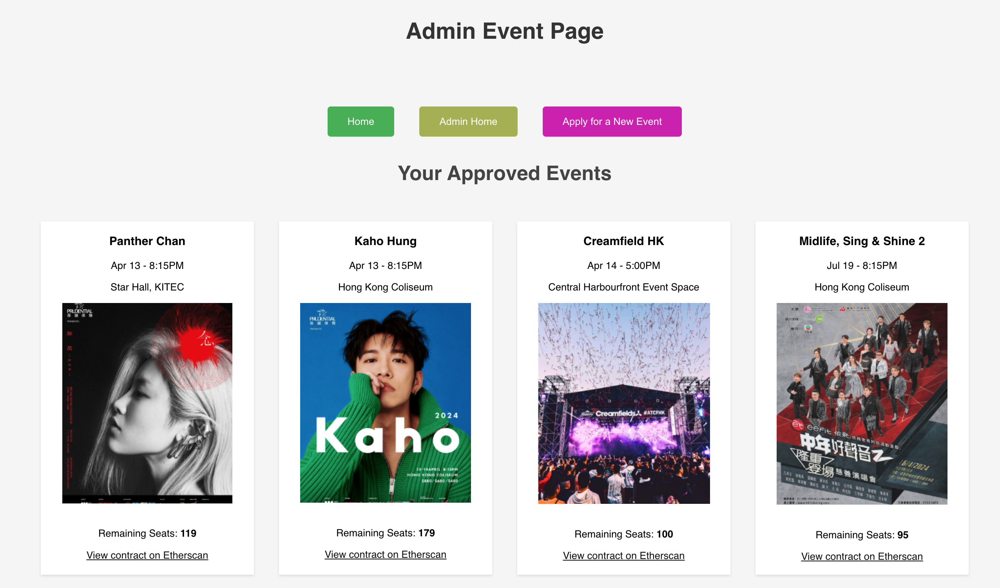
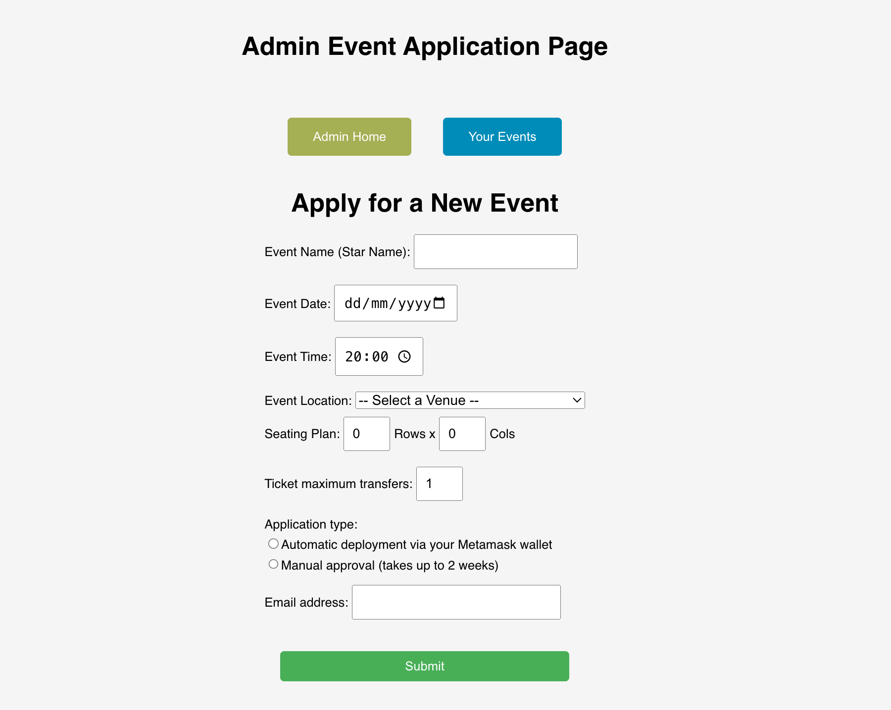
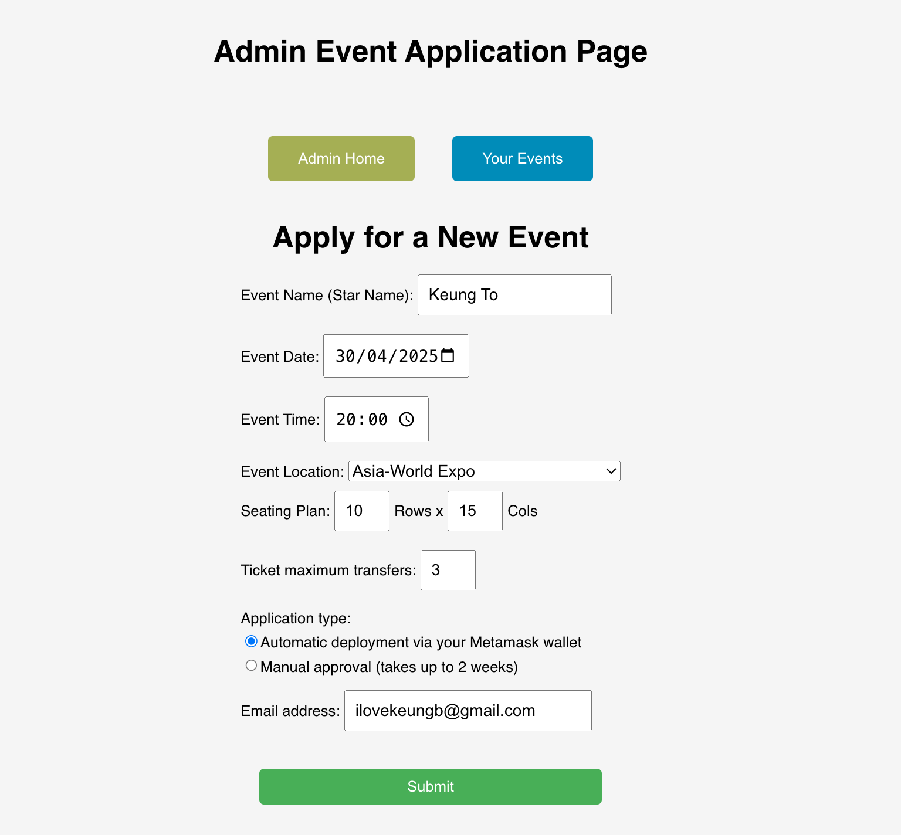
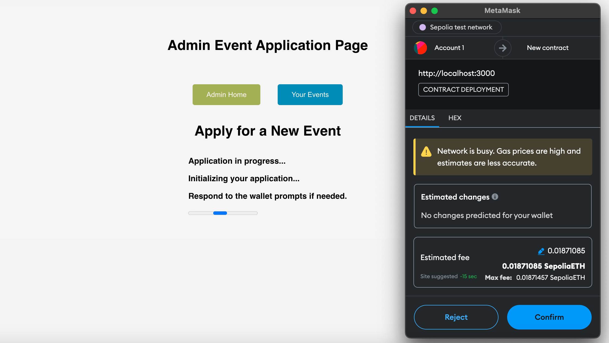
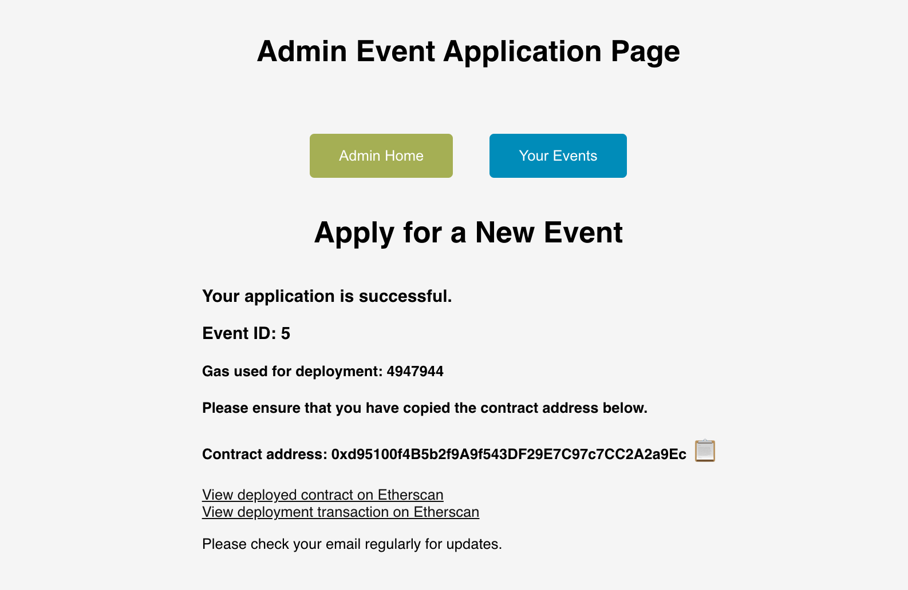

# Demonstration
This document contains several screenshots of the website demonstration. 

## Home Page
Our home page is an interface containing the purchased tickets of a wallet address. The arrows can be clicked to switch from one ticket to another. 

### Purchasing a new ticket
First, click on the `Events` page to see the list of events available. 

After clicking into an event, wait for the seating plan to load and choose a seat. 

Once the seat is chosen, press on `Proceed to Payment` to continue. A new payment page will be redirected. 

Click on `Pay Now` to continue. The Metamask wallet window will be prompted (if you are connected to the Sepolia testnet correctly). Respond to the wallet prompts and confirm the transaction to continue the payment process. 

After the payment is processed, the contract address of the event will be displayed. You can copy this address and obtain the NFT from the wallet. Moreover, a redirect link is available to view the transaction on [Etherscan](https://sepolia.etherscan.io/). 

After successfully obtaining the NFT from the contract address, you can see that it is added to your Metamask wallet. 

### Transferring a ticket
Ticket transfer service is available in the website, as long as the ticket can still be transferred. To start transferring a ticket, click on `Transfer your ticket?` inside the ticket section of home page. You will be redirected to a transfer page as below. 

Enter the recipient address in the text box, then click on `Transfer Ticket`. You will be prompted to the Metamask wallet. Click `Confirm` in the wallet to continue. 

Once the transfer process is completed, you can view your transaction on [Etherscan](https://sepolia.etherscan.io/). 

Sometimes, the limit of the maximum ticket transfer counts is reached. In that case, you cannot enter the transfer page and transfer this ticket anymore. 

## Admin Page
In your browser, type `localhost:3000/admin/events` to enter the admin page. If you are not logged in, you will be prompted to login. You can use the demonstration account, with the username "admin" and password "fite2010" to login the admin section. 

After successful login, you will be redirected to the page again. This admin page contains all the events that are currently available and manually approved. 

For each event, the remaining seats can be seen. The hyperlink redirecting to the smart contract on Etherscan is also available. Note that the seating plan details cannot be viewed in the admin page, this can be only viewed from the user perspective. 

## Apply for a New Event

From the page above, click on the button `Apply for a New Event` to start an event application. You will be prompted to another page as below. 

Fill in the form to apply for the new event. An example of the filled form is shown below. 

Note that there will not be any immediate changes on the page after the event application, as the current admin page is hard-coded with the four events pre-defined. 

### Manual Application
The website will respond with different behaviours, depending on the application type. If the application type is manual, you will get an acknowledgement, with a text response of "Your application is pending approval. Please check your email regularly for updates.". 

### Automatic Application
If the application type is automatic, a contract creation process is performed once the form is submitted. Respond to the wallet prompts (a total of 4 prompts) and confirm the transaction to continue the contract creation process. 

Upon successful application and payment, the application receipt will be prompted in the same website. Take note of the event ID and the contract address, as this will not be shown after leaving this page. 

Moreover, in the application receipt, two hyperlinks, pointing to the deployed contract and the contract deployment transaction on Etherscan, is available. 
