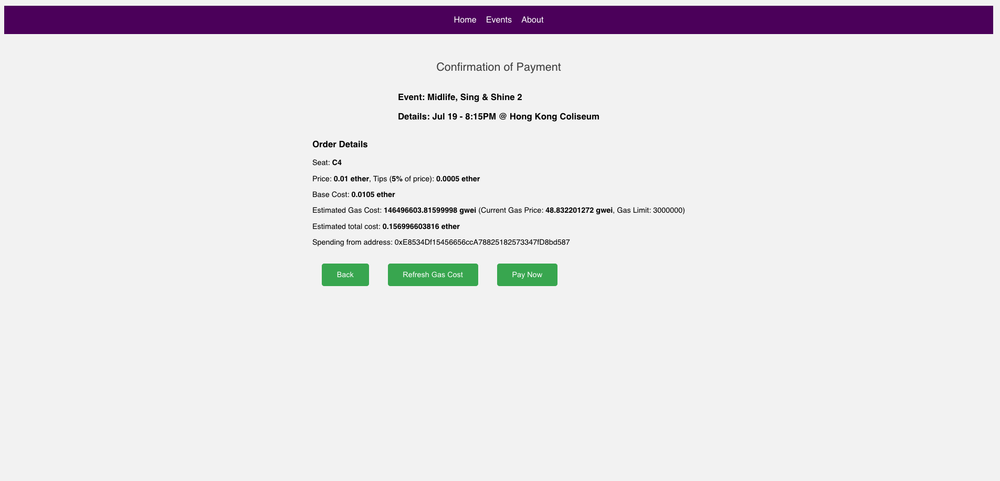

# Demonstration
This document contains several screenshots of the website demonstration. 

## Home Page
Our home page is an interface containing the purchased tickets of a wallet address. The arrows can be clicked to switch from one ticket to another. 

## Purchasing a new ticket
First, click on the `Events` page to see the list of events available. 

After clicking into an event, wait for the seating plan to load and choose a seat. 

Once the seat is chosen, press on `Proceed to Payment` to continue. A new payment page will be redirected. 

Click on `Pay Now` to continue. The Metamask wallet window will be prompted (if you are connected to the Sepolia testnet correctly). Respond to the wallet prompts and confirm the transaction to continue the payment process. 

After the payment is processed, the contract address of the event will be displayed. You can copy this address and obtain the NFT from the wallet. Moreover, a redirect link is available to view the transaction on [Etherscan](https://sepolia.etherscan.io/). 

After successfully obtaining the NFT from the contract address, you can see that it is added to your Metamask wallet. 

## Transferring a ticket
Ticket transfer service is available in the website, as long as the ticket can still be transferred. To start transferring a ticket, click on `Transfer your ticket?` inside the ticket section of home page. You will be redirected to a transfer page as below. 

Enter the recipient address in the text box, then click on `Transfer Ticket`. You will be prompted to the Metamask wallet. Click `Confirm` in the wallet to continue. 

Once the transfer process is completed, you can view your transaction on [Etherscan](https://sepolia.etherscan.io/). 

Sometimes, the limit of the maximum ticket transfer counts is reached. In that case, you cannot enter the transfer page and transfer this ticket anymore. 

